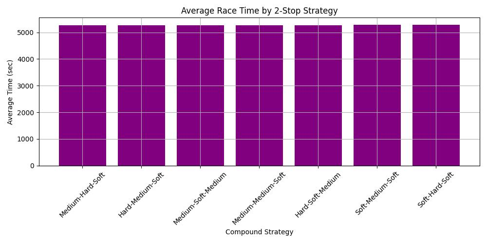
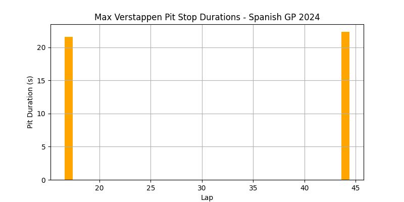
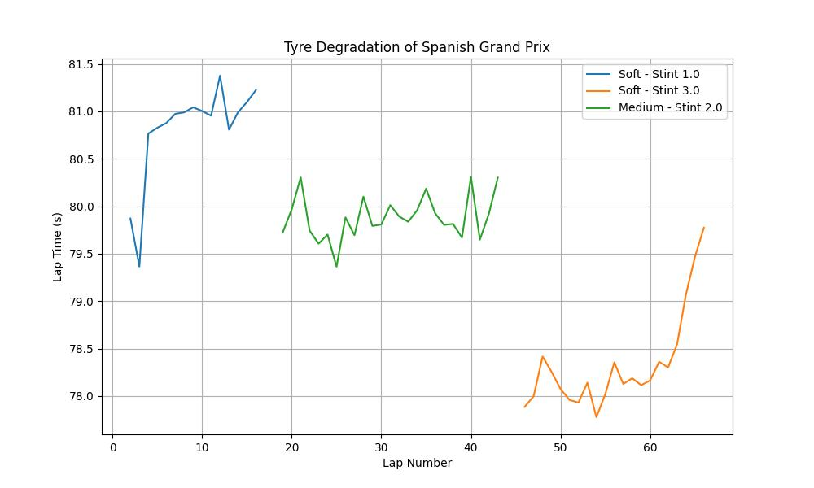

# F1 Race Strategy Simulation - Monte Carlo Simulation 🏎️

- This project simulates Formula 1 strategies using Monte Carlo Simulations to identify the fastest 2-stop strategies under variable race conditions.
- By combining real-world telemetry data from **FastF1**, tire degradation models, and stochastic safety events, the simulation provides optimal pit windows and compound choices.

## 🔑 Key Features 

- **Monte Carlo Simulation**: Simulates 10,000 race iterations under variable conditions to evaluate multiple two-stop strategies and their performance variability.
- **Tire Degradation Modelling**:Implements a smart degradation algorithm that considers only stints longer than 4 laps, detects outlier wear patterns, and estimates compound-specific degradation rates with high accuracy.
- **Safety Events Integration**:Incorporates probabilistic modeling of Safety Cars, Virtual Safety Cars (VSC), Yellow Flags, and Red Flags based on historical race data to capture real-world unpredictability.
- **Visual Insights**: Provides clear visualizations including race-time distributions, compound strategy comparisons, and pit window optimization overlays to support data-driven decision-making.

## 📂 Data Sources

- **FastF1**: Extracted session, lap timing, telemetry data, and historical race information, including safety event occurrences for stochastic modeling.
- **Pirelli**: Used as a fallback reference for tire wear rates when the degradation model detects anomalies or insufficient stint data.
- **F1 TV**: Cross-referenced telemetry with on-track footage to identify causes of data anomalies, such as traffic, off-track excursions, or incidents.

## 🧠 Methodology

1. **Data Extraction**: Retrieved session, lap, and telemetry data using **FastF1**, including sector times, compound usage, and pit stop windows.
2. **Tire Degradation Modeling**: Built **compound-specific degradation curves** to estimate lap-time loss per lap, automatically detecting outliers and anomalous stints.
3. **Stochastic Race Events**: Incorporated **probabilistic modeling** for **Safety Cars, VSCs, Yellow Flags, and Red Flags** using historical race event frequencies.
4. **Monte Carlo Simulation**: Ran **10,000 race iterations** per strategy, simulating variations in tire wear, pit stop timings, and race disruptions.
5. **Strategy Evaluation**: Compared strategies based on:
   - **Average race time** → fastest expected outcome.
   - **Variability** → reliability under uncertainty.
   - **Optimal pit windows** → best stint lengths for each compound.

## 📊 Results

### **Simulation Overview**
- **Total Simulations**: 10,000  
- **Race Distance**: 66 laps *(Spanish Grand Prix)*  
- **Driver Baseline**: Max Verstappen *(average lap time: **79.574s**)*  
- **Average Pit Stop Duration**: **22.0s**  
- **Stochastic Modeling**:  
  - **Safety Car Probability**: 28.6%  
  - **Virtual Safety Car Probability**: 0.0%  
  - **Red Flag Probability**: 14.3%

---

### **Tire Degradation Rates**
| **Compound** | **Avg Degradation** *(sec/lap)* |
|-------------|----------------------------------|
| Soft        | **+0.095s** |
| Medium      | **+0.024s** |
| Hard        | **+0.020s** |

---

### **Optimal 2-Stop Strategy**
| **Stint** | **Compound** | **Laps** |
|-----------|-------------|-----------|
| Stint 1   | Medium      | 18 laps   |
| Stint 2   | Hard        | 30 laps   |
| Stint 3   | Soft        | 18 laps   |

- **Predicted Race Time**: **5,265.25s** *(≈ 87 minutes 45 seconds)*  
- **Performance Gain**: ~ **6.2s faster** vs baseline strategies

### **Visual Insights**

#### **1. Average Race Time by 2-Stop Strategy**




## 🛠️ Tech Stack

- Python, Jupyter
- FastF1 API
- NumPy, Pandas, Matplotlib
- Seaborn, Poltly
- Scikit-learn (for data processing)

## 🚀 How to Run
1. Clone the repository:
   ```bash
   git clone https://github.com/Arthavpatel/<repo_name>.git
   pip install -r requirements.txt
   jupyter notebook Race_Strategy_Simulation.ipynb

## 🔄 Future Improvements
- Integrate live telemetry updates via OpenF1.
- Include weather-based degradation models.
- Build an interactive dashboard using Plotly Dash.

## 👤 Author
**Arthav Patel**  
Data Science Student @ Simon Fraser University  
Passionate about **Formula 1 strategy & vehicle performance analytics**  

🔗 [LinkedIn](https://linkedin.com/in/arthav-hitesh-patel) | [GitHub](https://github.com/Arthavpatel)


